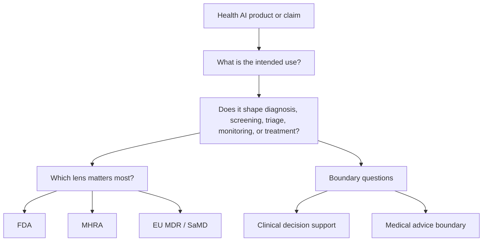

# Health AI Regulatory Map

A small public reference project from MedSentinel for thinking more clearly about regulation, governance, and safety boundaries in health AI.

This repository is designed as an editorial and research map.
It is not legal advice, regulatory advice, or a compliance checklist.

## Why this exists

Health AI conversations often jump too quickly between product claims and broad statements about regulation.

That creates two common problems:

- people use regulatory language too loosely
- people treat complex frameworks as if they were simple approval labels

This repository is an attempt to slow that down.

It provides a structured starting point for understanding:

- which frameworks matter
- what questions they help answer
- where their limits are
- how they relate to current health AI products and claims

## Scope

This project focuses on public-facing orientation, not formal compliance interpretation.

It is built for:

- health AI founders
- researchers
- journalists
- product teams
- policy readers
- technically literate clinicians

It is especially useful for topics such as:

- patient-facing AI
- clinical decision support
- software as a medical device
- AI-enabled workflow systems
- safety and risk management
- medical advice boundaries

## Current contents

- [glossary.md](./glossary.md): working definitions for recurring health AI regulatory terms
- [frameworks/comparison.md](./frameworks/comparison.md): a quick comparison of the main lenses in this repository
- [frameworks/fda.md](./frameworks/fda.md): the FDA lens and the questions it raises
- [frameworks/mhra.md](./frameworks/mhra.md): the MHRA lens and UK-facing questions
- [frameworks/eu-mdr-samd.md](./frameworks/eu-mdr-samd.md): EU MDR and SaMD-oriented framing
- [boundaries/clinical-decision-support.md](./boundaries/clinical-decision-support.md): where clinical decision support becomes a harder regulatory question
- [boundaries/medical-advice-boundary.md](./boundaries/medical-advice-boundary.md): why medical advice boundaries matter for patient-facing AI

## At-a-glance diagram

This repository is built to answer two kinds of questions:

- framework questions, such as which regulatory lens matters most
- boundary questions, such as when support starts becoming meaningful clinical influence

## How to use this repository

Use this map to orient your thinking, not to replace formal review.

A good workflow is:

1. identify the product or claim you are trying to understand
2. locate the most relevant framework or boundary document
3. use the key questions in that document to clarify the issue
4. note what remains uncertain
5. escalate to expert legal or regulatory review where needed

If you are not sure where to start, begin with:

1. [frameworks/comparison.md](./frameworks/comparison.md)
2. [glossary.md](./glossary.md)
3. the most relevant boundary note for the product claim

## Design principles

- prefer clear questions over fake certainty
- distinguish marketing language from regulatory language
- separate product usefulness from regulatory status
- keep safety, intended use, and human oversight central

## What this repository does not do

It does not:

- determine whether a product is compliant
- replace legal counsel
- issue regulatory conclusions
- certify a system as safe

## Version

Current version: `v0.1`

The first version is intentionally compact.
It is meant to be readable, extensible, and safe to reference in public discussion.
